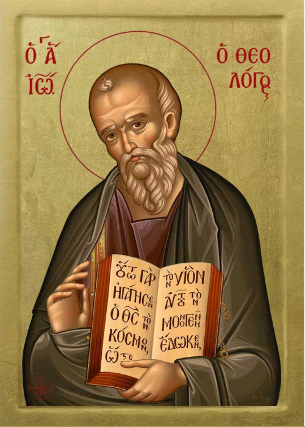

<!-- # St. Elijah Evangelisation -->

«I am the light of the world. Whoever follows me does not walk in darkness but has the light of life» (Jn 8:12)

«I am the way and the truth and the life» (Jn 14:6)

* It is the responsibility of the information engineer to protect others from online evils.

* Please visit my blog: <a href="https://stelijah.co.uk/"><b>https://stelijah.co.uk/</b></a>

* Please visit:

<table>
    <tr>
        <td>
            <a href="https://github.com/Pornography-Protection">
             <!-- was Archangel Michael.jpg -->
            </a>
        </td>
        <td>
            
        </td>
        <td>
            
        </td>
    </tr>
    <tr>
        <td>
                <a href="https://github.com/Pornography-Protection"><b>1. Pornography-Protection</b></a>
        </td>
        <td>
                <a href="https://github.com/Evangelisation"><b>2. Evangelisation</b></a>
        </td>
        <td>
                <a href="https://github.com/Writing-Tools"><b>3. Writing-Tools</b></a>
        </td>
    </tr>
</table>
